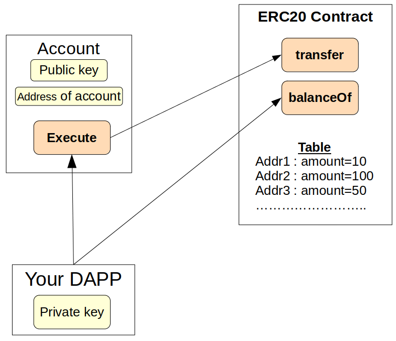

# Work with ERC20 tokens

Based on what has been seen in the previous pages of this guide, we will use an ERC20 contract.

## What's an ERC20

As in Ethereum, a token has an ERC20 contract to manage it. This contract contains a table, that lists the quantity of tokens owned by each involved account:


For example, Account address 2 owns 100 tokens of this ERC20 contract.

Users have the feeling that their tokens are stored in their wallets, but it's absolutely false. You have no list of assets stored in your account contract. In fact, a token has its own ERC20 contract, and the amount of token owned by your account address is stored in this contract.

If you want to have your balance of a token, ask for its ERC20 contract, with the function `ERC20contract.balanceOf(accountAddress)`.

When you want to transfer some tokens in your possession, you have to use the ERC20 contract function `transfer`, through the `account.execute` function (or meta-class methods). In this way, Starknet.js will send to the account contract a message signed with the private key.

This message contains the name of the function to call in the ERC20 contract, with its optional parameters.

The account contract will use the public key to check that you have the private key, then will ask the ERC20 contract to execute the requested function.

This way, the ERC20 contract is absolutely sure that the caller of the transfer function knows the private key of this account.

## ETH token is an ERC20 in Starknet

In opposition to Ethereum, the ETH token is an ERC20 in Starknet, like all other tokens. In all networks, its ERC20 contract address is:

```typescript
const addrETH = "0x049d36570d4e46f48e99674bd3fcc84644ddd6b96f7c741b1562b82f9e004dc7";
```

## Deploy an ERC20

Let's dive down the rabbit hole!

This example works with an ERC20 mintable (everybody can mint new tokens), that we will deploy on the devnet (launched with `starknet-devnet --seed 0`).

First, let's initialize an account:

```typescript
// initialize provider
const provider = new Provider({ sequencer: { baseUrl:"http://127.0.0.1:5050"  } });
// initialize existing pre-deployed account 0 of Devnet
const privateKey = "0xe3e70682c2094cac629f6fbed82c07cd";
const accountAddress = "0x7e00d496e324876bbc8531f2d9a82bf154d1a04a50218ee74cdd372f75a551a";

const account0 = new Account(provider, accountAddress, privateKey);
```

Declaration and deployment of the ERC20 contract:

```typescript
// Deploy an ERC20 contract
console.log("Deployment Tx - ERC20 Contract to Starknet...");
const compiledErc20mintable = json.parse(fs.readFileSync("compiled_contracts/ERC20MintableOZ051.json").toString("ascii"));
    const initialTk: Uint256 = cairo.uint256(100);
    const erc20CallData: CallData = new CallData(compiledErc20mintable.abi);
    const ERC20ConstructorCallData: Calldata = erc20CallData.compile("constructor", {
        name: "niceToken",
        symbol: "NIT",
        decimals: 18,
        initial_supply: initialTk,
        recipient: account0.address,
        owner: account0.address
    });

    console.log("constructor=", ERC20ConstructorCallData);
    const deployERC20Response = await account0.declareAndDeploy({
        contract: compiledErc20mintable,
        constructorCalldata: ERC20ConstructorCallData
    });
    console.log("ERC20 declared hash: ", deployERC20Response.declare.class_hash);
    console.log("ERC20 deployed at address: ", deployERC20Response.deploy.contract_address);

// Get the erc20 contract address
const erc20Address = deployERC20Response.deploy.contract_address;
// Create a new erc20 contract object
const erc20 = new Contract(compiledErc20mintable.abi, erc20Address, provider);
erc20.connect(account0);
```

## Interact with an ERC20

Here we will read the balance, mint new tokens, and transfer tokens:

```typescript
// Check balance - should be 100
console.log(`Calling Starknet for account balance...`);
const balanceInitial = await erc20.balanceOf(account0.address);
console.log("account0 has a balance of:", uint256.uint256ToBN(balanceInitial.balance).toString()); // Cairo 0 response

// Mint 1000 tokens to account address
const amountToMint = cairo.uint256(1000);
console.log("Invoke Tx - Minting 1000 tokens to account0...");
const { transaction_hash: mintTxHash } = await erc20.mint(
	account0.address,
	amountToMint,
	{ maxFee: 900_000_000_000_000 }
);

// Wait for the invoke transaction to be accepted on Starknet
console.log(`Waiting for Tx to be Accepted on Starknet - Minting...`);
await provider.waitForTransaction(mintTxHash);

// Check balance - should be 1100
console.log(`Calling Starknet for account balance...`);
const balanceBeforeTransfer = await erc20.balanceOf(account0.address);
console.log("account0 has a balance of:", uint256.uint256ToBN(balanceBeforeTransfer.balance).toString()); // Cairo 0 response

// Execute tx transfer of 10 tokens
console.log(`Invoke Tx - Transfer 10 tokens back to erc20 contract...`);
const toTransferTk: Uint256 = cairo.uint256(10);
const transferCallData: Call = erc20.populate("transfer", {
    recipient: erc20Address,
    amount: toTransferTk // with Cairo 1 contract, 'toTransferTk' can be replaced by '10n'
});
    const { transaction_hash: transferTxHash } = await erc20.transfer( transferCallData.calldata);

// Wait for the invoke transaction to be accepted on Starknet
console.log(`Waiting for Tx to be Accepted on Starknet - Transfer...`);
await provider.waitForTransaction(transferTxHash);

// Check balance after transfer - should be 1090
console.log(`Calling Starknet for account balance...`);
const balanceAfterTransfer = await erc20.balanceOf(account0.address);
console.log("account0 has a balance of:", uint256.uint256ToBN(balanceAfterTransfer.balance).toString()); // Cairo 0 response
console.log("✅ Script completed.");
```
